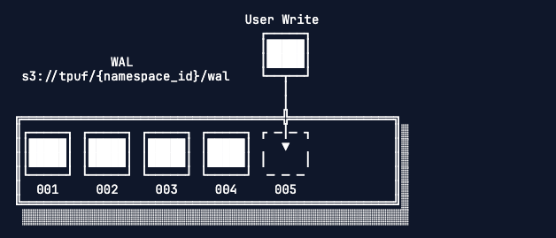
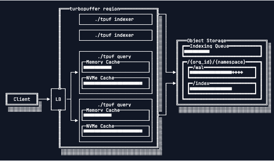
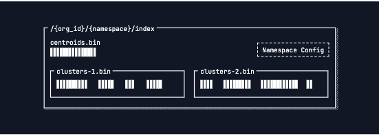
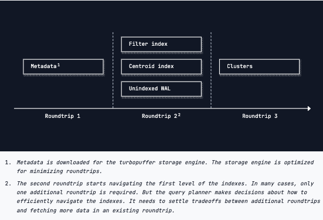

# Turbopuffer Notes

A collection of notes surrounding Turbopuffer's architecture decisions, tradeoffs, etc. gathered from public docs.

## Product

- Combines vector and full-text search using object storage

## Quickstart

```typescript
// npm install @turbopuffer/turbopuffer
import { Turbopuffer } from "@turbopuffer/turbopuffer";

const tpuf = new Turbopuffer({
  apiKey: process.env.TURBOPUFFER_API_KEY,
  region: "gcp-us-central1",
});

const ns = tpuf.namespace(`quickstart-example-ts`);

// Upsert with vectors and attributes
await ns.write({
  upsert_rows: [
    {
      id: 1,
      vector: [0.1, 0.2, 0.3],
      category: "mammal",
      public: 1,
      text: "walrus narwhal",
    },
  ],
  distance_metric: "cosine_distance",
  schema: {
    text: { type: "string", full_text_search: true },
  },
});

// Vector search with filters
const result = await ns.query({
  rank_by: ["vector", "ANN", [0.1, 0.2, 0.3]],
  limit: 10,
  filters: ["And", [["category", "Eq", "mammal"], ["public", "Eq", 1]]],
  include_attributes: ["category"],
});

// Full-text search
const ftsResult = await ns.query({
  limit: 10,
  filters: ["category", "Eq", "mammal"],
  rank_by: ["text", "BM25", "quick walrus"],
});

// Delete by ID
await ns.write({ deletes: [1, 3] });
```

## Architecture Overview


- Client communicates via API, API routes to a cluster of Rust binaries that access object storage
- Uses object storage for state (allowes stateless nodes)
- NVMe SSD with memory cache for compute, caches only store actively searched data
- Scales horizontally because you can always spin up more nodes / more storage
- After first quer (which reads object storage directly), subsequent queries can be routed to same node for cache locality
- Any query node can serve queries from any namespace


## WAL



- Every writes adds a new file to the WAL directory inside the namespace's prefix (`s3://tpuf/{namespace_id}/wal`)
- Ensures consistency and that data will be durably written to object storage
- Asynchronously indexed, can still be retrieved if not indexed but slower
- Can configure eventual consistency for slower warm latency

## Indexing



- Use ANN for vectors (based on SPFresh - centroid index)
- Inverted BM25 indexes for full-text search
- Exact indexes for metadata filtering
- On a cold query, centroid index is downloaded from object storage, searched, and then data is fetched
- On future queries, can avoid S3 roundtrip
- Have indexing workers that help update the index




## Guarantees
- Durable reads
- Consistent reads (99.8%)
- Atomic conditional writes
- Atomic batches
- Smart caching
- Autoscaling
- ACID without the I
- Favour consistency over availability when object storage is unreachable

## Tradeoffs
- High latency, high throughput writes
- Focused on first stage retrieval
- Optimized for accuracy

## Regions
- AWS and GCP
- Azure available for BYOC but not public regions

## Security
- All data hosted specifically in specified regions
- Encrypted in transit with TLS1.2+, at rest with AES-256 (key optional)
- SOC2, GDPR, CCPA, HIPAA 

## Privacy
- Each tpuf binary handles requests for multiple tenants
- Can get single-tenancy clusters or BYOC on enterprise tier
- Skipped the rest of the encryption / private-networking stuff

## Performance

- Cold queries - 1M vectors => p90 = 444ms, warm queries p50 = 8ms
- Can send pre-flight queries which will warm up in advance
- Every namespace can currently write 1 WAL entry per second - concurrent writes are batched
- Eventual consistency - staleness of up to one hour


## Backups

```python
# /// script
# requires-python = ">=3.10"
# dependencies = ["turbopuffer"]
# ///

import os
import time

import turbopuffer

# Configuration
SOURCE_REGION = "gcp-us-central1"
BACKUP_REGION = "gcp-us-west1"
SOURCE_PREFIX = "fts-"  # Back up all namespaces starting with "fts-"
BACKUP_PREFIX = "backup-"  # Backup namespaces will be "backup-{name}-{date}"
RETENTION_DAYS = 7

source_client = turbopuffer.Turbopuffer(
    api_key=os.getenv("TURBOPUFFER_API_KEY"), region=SOURCE_REGION
)
backup_client = turbopuffer.Turbopuffer(
    api_key=os.getenv("TURBOPUFFER_API_KEY"), region=BACKUP_REGION
)

timestamp = int(time.time())  # Unix epoch seconds
start_time = time.time()

# Step 1: Back up each namespace matching the source prefix
print("Starting backups...")
namespaces = list(source_client.namespaces(prefix=SOURCE_PREFIX))

for ns in namespaces:
    backup_name = f"{BACKUP_PREFIX}{ns.id}-{timestamp:010d}"
    print(f"  Backing up: {ns.id}")
    backup_ns = backup_client.namespace(backup_name)

    backup_ns.write(
        copy_from_namespace={
            "source_namespace": ns.id,
            "source_region": SOURCE_REGION,
            # if backing up to a different organization, include source_api_key:
            # "source_api_key": "<source-org-api-key>",
        }
    )

# Step 2: Delete old backups beyond the retention period (after successful backup)
print("Cleaning up old backups...")
cutoff = int(time.time()) - RETENTION_DAYS * 86400
deleted = 0

for ns in backup_client.namespaces(prefix=BACKUP_PREFIX):
    # Safety check: only delete namespaces that match our backup prefix
    assert len(BACKUP_PREFIX) > 0 and ns.id.startswith(
        BACKUP_PREFIX
    ), f"Refusing to delete namespace that doesn't match backup prefix: {ns.id}"

    # Extract timestamp from backup namespace name (e.g., "backup-prod-users-1234567890")
    if len(ns.id) >= 10:
        try:
            backup_time = int(ns.id[-10:])
            if backup_time < cutoff:
                print(f"  Deleting: {ns.id}")
                backup_client.namespace(ns.id).delete_all()
                deleted += 1
        except ValueError:
            print(
                f"  Skipping {ns.id}: invalid timestamp format",
                file=__import__("sys").stderr,
            )

print(
    f"Done: backed up {len(namespaces)} namespaces, deleted {deleted} old backups in {time.time() - start_time:.1f}s"
)
```

## Performance
- Choose smaller id sizes - should matter
- `filterable: false` for attributes that will not be filtered
- Smaller vectors are faster
- Batch writes
- Concurrent writes

## Pinning

Reserved compute and NVMe SSD for a namespace. Billing switches from per-query to GB-hours. Break-even ~10 QPS for namespaces >16 GB.

```python
# Enable pinning with 2 replicas
ns.update_metadata(pinning={'replicas': 2}) # read replicas

# Disable pinning
ns.update_metadata(pinning=None)
```

## Testing

Use random namespace names and clean up with `deleteAll()` in teardown.

```typescript
// Run with vitest
import { expect, test, beforeEach, afterEach } from 'vitest'
import { NotFoundError, Turbopuffer } from "@turbopuffer/turbopuffer";
import * as crypto from "crypto";

const tpuf = new Turbopuffer({ region: "gcp-us-central1" });
let ns: Namespace;

beforeEach(async () => {
  const randomSuffix = crypto.randomBytes(16).toString("hex");
  ns = tpuf.namespace(`test-${randomSuffix}`);
});

afterEach(async () => {
  try {
    await ns.deleteAll();
  } catch (e: any) {
    if (!(e instanceof NotFoundError)) throw e;
  }
});

test("query test", async () => {
  await ns.write({
    upsert_rows: [
      { id: 1, vector: [1, 1] },
      { id: 2, vector: [2, 2] },
    ],
    distance_metric: "euclidean_squared",
  });
  const res = await ns.query({
    rank_by: ["vector", "ANN", [1.1, 1.1]],
    limit: 10,
  });
  expect(res.rows![0].id).toBe(1);
});
```

## Permissions

No built-in row/document-level RBAC. Implement at user-level with filters.

```typescript
// Filter by user_id attribute for multi-tenant namespaces
const result = await ns.query({
  rank_by: ["vector", "ANN", queryVector],
  filters: ["user_id", "Eq", currentUserId],
  limit: 10,
});
```