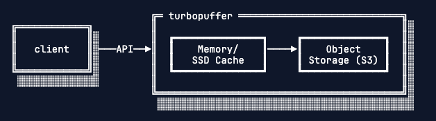

# Turbopuffer Notes

A collection of notes surrounding Turbopuffer's architecture decisions, tradeoffs, etc. gathered from public docs.

## Architecture Overview

The architecture shows:
- Client communicates via API
- Turbopuffer contains Memory/SSD Cache layer
- Object Storage (S3) backend for persistence

## 